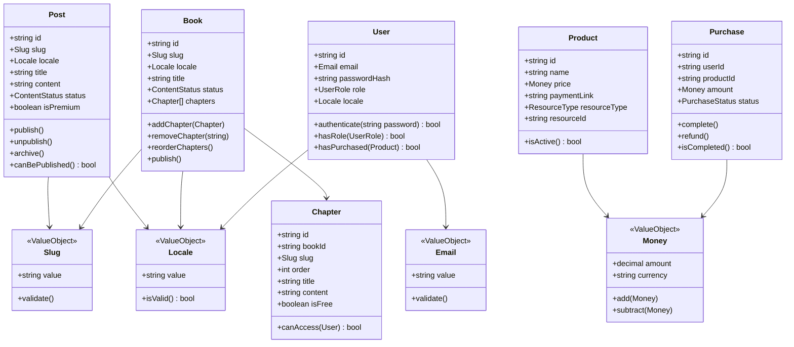

# Diagramas de Arquitectura - Stories of Software
## Visual Architecture Diagrams

**Versión:** 1.0  
**Formato:** Mermaid Diagrams  
**Propósito:** Documentación visual de la arquitectura

---

## 📋 Tabla de Contenidos

1. [Arquitectura General](#arquitectura-general)
2. [Flujo de Datos](#flujo-de-datos)
3. [Modelo de Dominio](#modelo-de-dominio)
4. [Workflows de Automatización](#workflows-de-automatización)
5. [Deployment Architecture](#deployment-architecture)
6. [Secuencia de Casos de Uso](#secuencia-de-casos-de-uso)

---

## 🏗️ Arquitectura General

### High-Level System Architecture


### Frontend Architecture

```mermaid
graph LR
    subgraph "Next.js App Router"
        Root[app/]
        Locale[app/\[locale\]/]
        
        subgraph "Routes"
            Home[Home Page]
            Blog[Blog Section]
            Books[Books Section]
            Admin[Admin Dashboard]
        end
    end

    subgraph "Components"
        UI[UI Components<br/>shadcn/ui]
        Layout[Layout Components]
        Features[Feature Components]
    end

    subgraph "State & Data"
        Query[React Query<br/>Server State]
        Zustand[Zustand<br/>Client State]
        i18n[next-intl<br/>Translations]
    end

    Root --> Locale
    Locale --> Home
    Locale --> Blog
    Locale --> Books
    Locale --> Admin
    
    Home --> UI
    Blog --> UI
    Books --> UI
    Admin --> UI
    
    Home --> Layout
    Blog --> Layout
    
    Home --> Features
    
    Features --> Query
    Features --> Zustand
    Layout --> i18n

    style Root fill:#0070f3,color:#fff
    style Query fill:#ff4154,color:#fff
    style Zustand fill:#443e38,color:#fff
```

### Backend Architecture - Clean Architecture Layers


---

## 🔄 Flujo de Datos

### Publishing Flow - Post Publication


### User Authentication Flow


### Premium Content Access Flow


---

## 📊 Modelo de Dominio

### Entity Relationship Diagram


### Domain Model - Core Entities



---

## 🤖 Workflows de Automatización

### Publishing Workflow (n8n)


### Newsletter Workflow (n8n)


### Backup Workflow (n8n)


---

## 🚀 Deployment Architecture

### Production Infrastructure


### Docker Compose Services


---

## 📱 Secuencia de Casos de Uso

### Use Case: User Registration


### Use Case: Create and Publish Post


### Use Case: Access Premium Content


---

## 🔄 State Machine Diagrams

### Post Status State Machine


### Purchase Status State Machine


---

## 📊 System Metrics Dashboard

### Key Metrics Overview


---

## 🎨 UI/UX Flow

### User Journey - Reading a Blog Post


---

**Nota:** Estos diagramas pueden ser renderizados en cualquier herramienta compatible con Mermaid (GitHub, GitLab, VS Code con extensión Mermaid, etc.)

**Para editar:** Copia el código Mermaid en [Mermaid Live Editor](https://mermaid.live/)